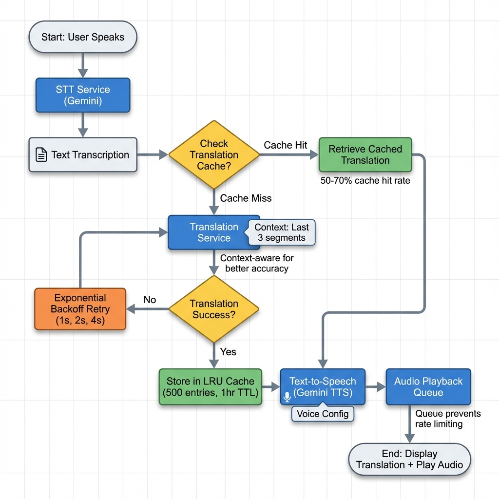
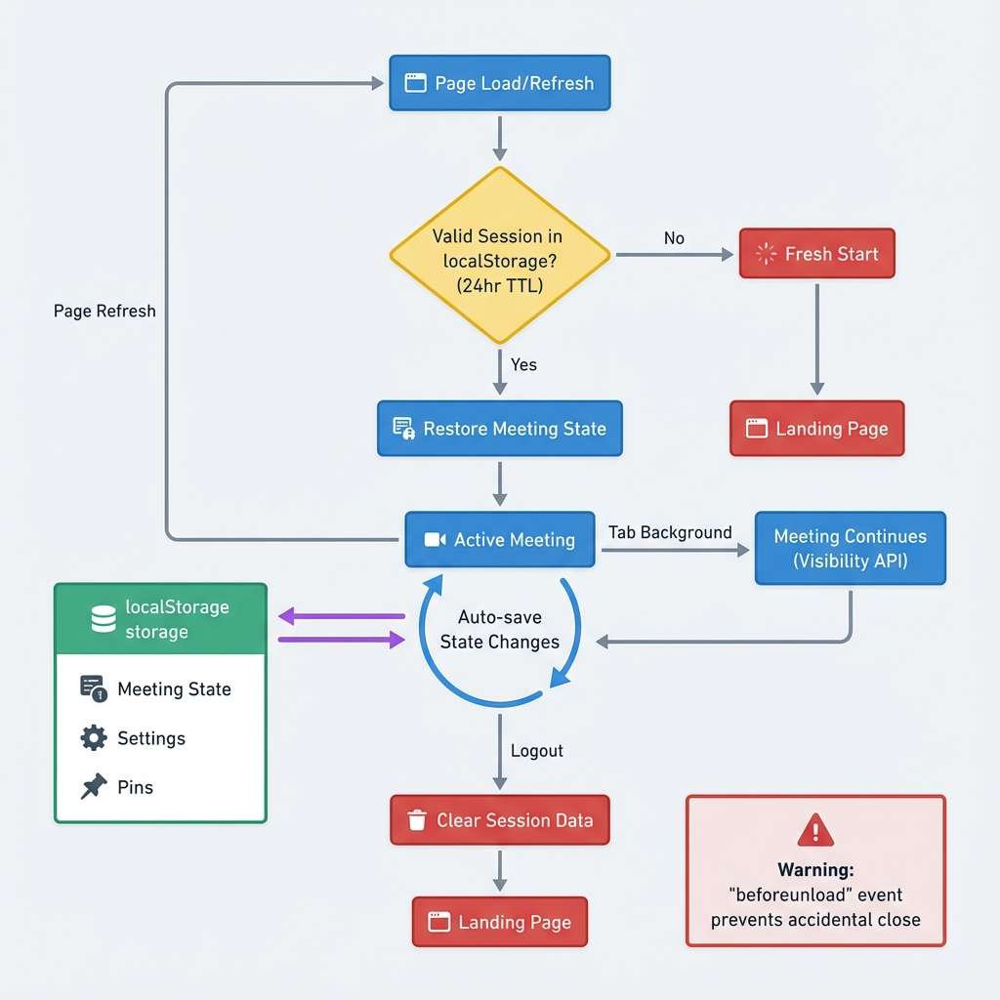

# Orbits Zoom like Meeting Platform with Translation realtime

> **Real-time AI-powered video conferencing with instant translation, smart transcription, and intelligent meeting tools.**


## 🌟 Overview

Orbits v4 is a next-generation video conferencing platform that breaks down language barriers with real-time AI translation, live transcription, and intelligent meeting assistance. Built with modern web technologies and powered by Google's Gemini AI.

### Key Features

- 🎯 **Real-time Translation** - Instant translation between 100+ languages
- 🎙️ **Live Transcription** - YouTube-style live captions with auto-scroll
- 🤖 **AI Tools Hub** - Presentation builder, BGM generator, image creator, smart agenda
- 🔒 **Session Persistence** - Never lose your meeting on page refresh
- 📺 **Screen Sharing** - Pin and focus on shared screens
- 🎨 **Premium UI** - Glassmorphism design with smooth animations
- 🌐 **WebRTC** - Peer-to-peer video/audio with Supabase signaling

## 📊 Architecture

### Application Flow


The application follows a straightforward flow from authentication through meeting setup to the active meeting room where WebRTC, STT, and AI translation work in parallel.

### Translation Pipeline



Our translation system features:
- **50-70% cache hit rate** reducing API calls significantly
- **Context-aware translation** using last 3 segments for accuracy
- **Exponential backoff retry** with 1s, 2s, 4s delays
- **LRU cache** with 500 entries and 1-hour TTL

### Session Management



Session persistence ensures:
- **Auto-restore** on page refresh (24-hour TTL)
- **Background operation** via Visibility API
- **beforeunload warning** prevents accidental close
- **Clean logout** with session cleanup

## 🚀 Quick Start

### Prerequisites

- Node.js 18+ and npm
- Supabase account (free tier works)
- Google Cloud account for Gemini AI API
- Modern web browser (Chrome, Firefox, Edge, Safari)

### Installation

1. **Clone the repository**
   ```bash
   git clone https://github.com/panyeroa1/orbitv4.git
   cd orbitv4
   ```

2. **Install dependencies**
   ```bash
   npm install
   ```

3. **Configure environment**
   
   Create `.env.local` file:
   ```env
   VITE_SUPABASE_URL=your_supabase_url
   VITE_SUPABASE_ANON_KEY=your_supabase_anon_key
   VITE_GEMINI_API_KEY=your_gemini_api_key
   ```

4. **Setup database**
   
   Run the SQL migration in your Supabase dashboard:
   ```bash
   # Copy contents of supabase_schema.sql to Supabase SQL Editor
   ```

5. **Start development server**
   ```bash
   npm run dev
   ```

6. **Open browser**
   ```
   http://localhost:5173
   ```

## 🎯 Features Deep Dive

### Real-time Translation

- **Language Support**: 100+ languages via Gemini AI
- **Context-Aware**: Uses conversation history for accurate translations
- **Cache System**: LRU cache reduces API calls by 50-70%
- **Retry Logic**: Exponential backoff ensures reliability
- **Audio Toggle**: Choose to transmit raw or translated audio

### Live Transcription (YouTube-Style)

- **Auto-scroll**: Captions automatically scroll as speech continues
- **Multi-line Display**: Shows 2-3 lines of recent captions
- **Fade Animations**: Smooth transitions for new text
- **Toggle Control**: Show/hide captions as needed
- **Speaker Attribution**: Know who said what

### AI Tools Hub

#### 🎨 Deck Builder
Generate professional presentations from meeting topics

#### 🎵 Smart BGM
AI-curated background music from Pixabay

#### 🖼️ Image Generator
Create visual content with AI (Unsplash integration)

#### ✍️ Intro Writer
Craft compelling meeting introductions

#### ⏱️ Timer
Session time tracking and countdowns

#### 📋 Smart Agenda
Auto-generate meeting agendas from context

### Screen Sharing & Pinning

- **Priority System**: 6-level video rendering hierarchy
- **Host Controls**: Pin any screen share to focus
- **Visual Indicators**: Clear pinning status
- ** Auto-prioritization**: Screen shares take precedence

### Session Persistence

- **24-Hour TTL**: Sessions persist for a full day
- **Auto-restore**: Return to meeting on refresh
- **Background Support**: Meeting continues in inactive tabs
- **localStorage**: Client-side state management

## 🏗️ Project Structure

```
orbitsv4/
├── src/
│   ├── App.tsx              # Main application component
│   ├── types.ts             # TypeScript interfaces
│   ├── components/          # React components
│   │   ├── OrbitVisualizer.tsx
│   │   ├── AuthPage.tsx
│   │   ├── ChatInterface.tsx
│   │   └── ...
│   ├── hooks/               # Custom React hooks
│   │   └── useWebRTC.ts     # WebRTC connection management
│   ├── lib/                 # Core libraries
│   │   ├── gemini.ts        # Gemini AI client
│   │   ├── supabaseClient.ts
│   │   ├── translationService.ts
│   │   ├── translationCache.ts
│   │   ├── sessionStorage.ts
│   │   ├── sttService.ts
│   │   ├── audioQueue.ts
│   │   └── deviceUtils.ts
│   └── index.tsx            # Entry point
├── docs/
│   └── diagrams/            # Architecture diagrams
├── supabase_schema.sql      # Database schema
├── tasks.md                 # Development task log
└── README.md                # This file
```

## 🛠️ Technology Stack

### Frontend
- **React 18** - UI framework
- **TypeScript** - Type safety
- **Vite** - Build tool and dev server
- **Tailwind CSS** - Utility-first styling
- **Lucide React** - Icon library

### Backend & Services
- **Supabase** - Database, Auth, Realtime
- **Google Gemini AI** - Translation, STT, TTS
- **WebRTC** - Peer-to-peer communication

### Key Libraries
- `@google/generative-ai` - Gemini AI SDK
- `@supabase/supabase-js` - Supabase client
- `lucide-react` - Icons
- WebRTC native APIs

## 🔧 Configuration

### Supabase Setup

1. Create a new Supabase project
2. Enable Google OAuth in Authentication settings
3. Run `supabase_schema.sql` in SQL Editor
4. Copy URL and anon key to `.env.local`

### Gemini AI Setup

1. Go to [Google AI Studio](https://aistudio.google.com/app/apikey)
2. Create a new API key
3. Add to `.env.local` as `VITE_GEMINI_API_KEY`

### Database Tables

- `users` - User profiles and metadata
- `meetings` - Meeting sessions
- `participants` - Meeting participants
- `messages` - Chat messages
- `transcripts` - Speech transcriptions
- `ai_generations` - AI-generated content

## 📝 Development

### Task Management

This project uses `tasks.md` for tracking development tasks. Each task includes:
- Task ID and title
- Status (TODO/IN-PROGRESS/DONE)
- Start and end logs
- Files modified
- Testing results

### Code Style

- **ESLint** for linting
- **TypeScript strict mode**
- Component-based architecture
- Custom hooks for logic separation

### Building

```bash
# Development
npm run dev

# Production build
npm run build

# Preview production build
npm run preview
```

## 🚢 Deployment

### Vercel (Recommended)

1. Connect GitHub repository to Vercel
2. Add environment variables in Vercel dashboard
3. Deploy automatically on push to main

### Manual Build

```bash
npm run build
# Upload dist/ folder to your hosting
```

## 🤝 Contributing

While this is a proprietary project, contributions are welcome:

1. Fork the repository
2. Create feature branch (`git checkout -b feature/amazing-feature`)
3. Commit changes (`git commit -m 'Add amazing feature'`)
4. Push to branch (`git push origin feature/amazing-feature`)
5. Open Pull Request

## 📄 License

This project is licensed under the MIT License.

## 🙏 Acknowledgments

- **Google Gemini AI** for powerful translation and AI capabilities
- **Supabase** for seamless backend infrastructure
- **Eburon Development** for project sponsorship
- **Lucide** for beautiful icons

## 📞 Support

For issues and questions:
- GitHub Issues: [Report a bug](https://github.com/panyeroa1/orbitv4/issues)
- Documentation: Check this README and inline code comments
- Email: support@eburon.ai

---

**Built with ❤️ by Miles at Eburon Development**

*Breaking language barriers, one conversation at a time.*
